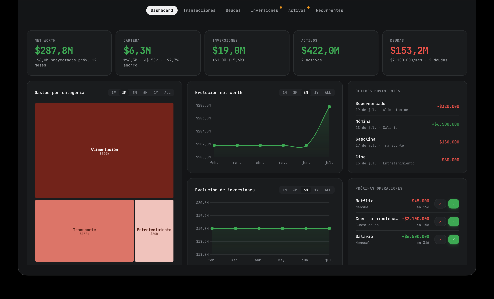
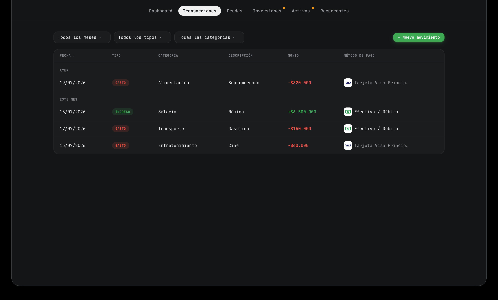
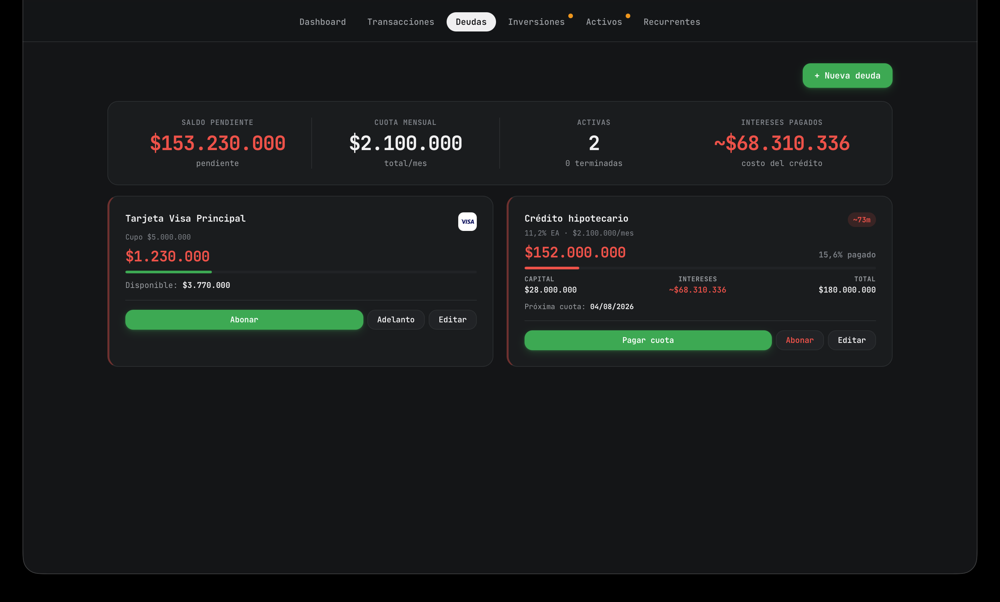
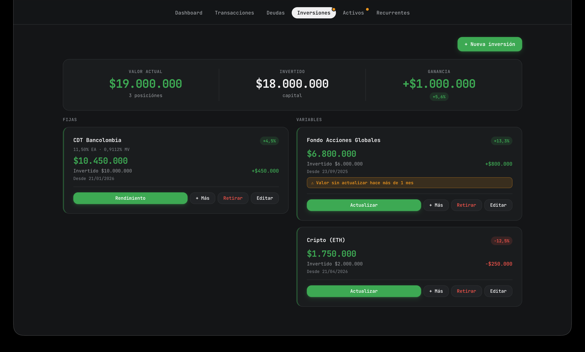
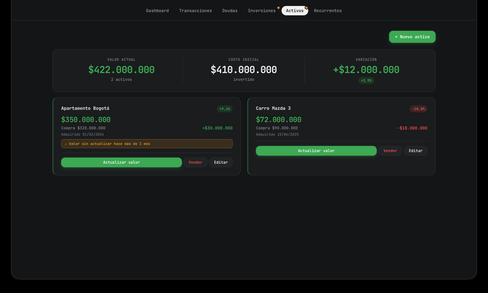
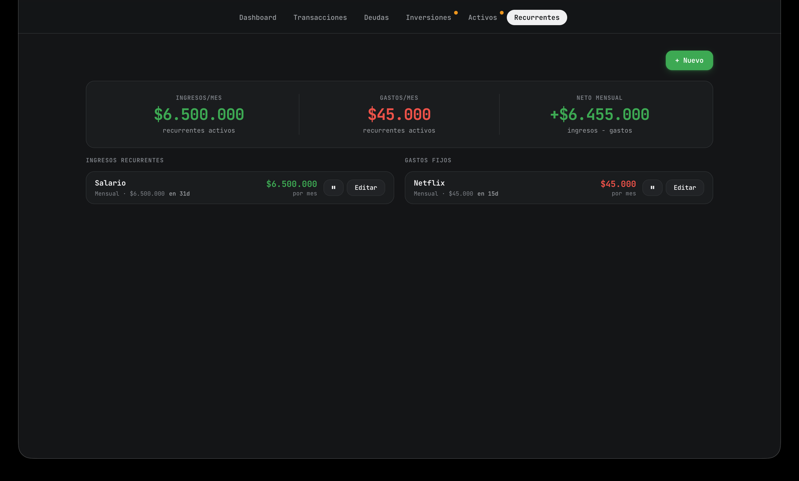
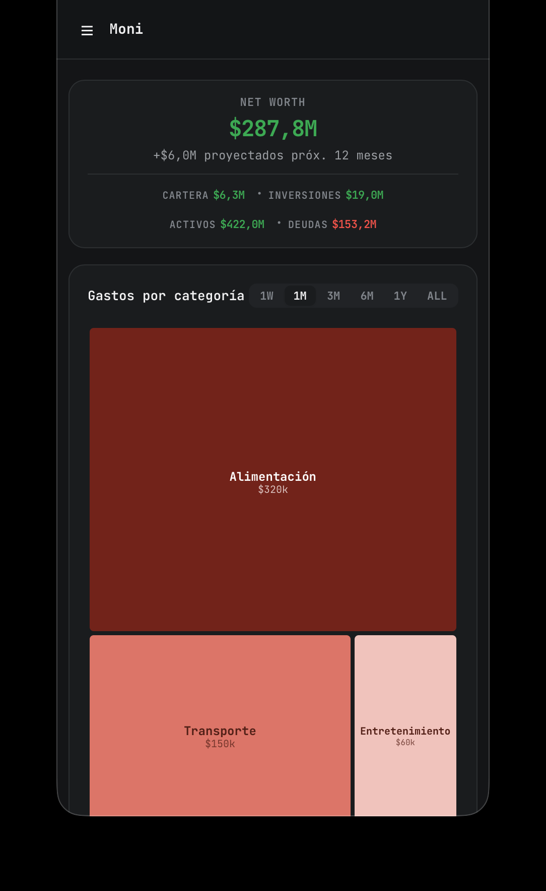
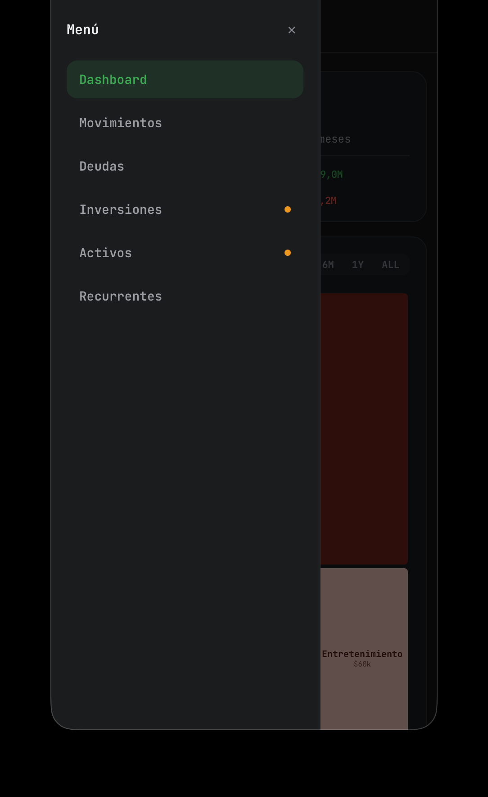

# Moni

Personal finance tracker for a single household: spending, credit cards, loans, investments, other assets, and recurring income/expenses — one dashboard instead of five spreadsheets. Spanish UI, Colombian peso (COP).

  



> ## ⚠️ LOCAL USE ONLY — NO AUTH
> This app has **no authentication or login system**. Anyone who can reach it can read and modify all data. It is meant to run on your local machine or a private/home network you trust.
>
> **Do not expose this to the public internet** (no open port-forward, no public reverse proxy) without putting your own auth layer in front of it (e.g. a reverse proxy with basic auth, a VPN/Tailscale, etc.).

## Contents

- [Features](#features)
- [How it fits together](#how-it-fits-together)
- [Running locally](#running-locally)
- [Running via Docker](#running-via-docker)
- [Deploying](#deploying)
- [Testing](#testing)

## Features

Six tabs, all reading from and writing to the same dataset — a debt payment, an investment contribution, or an asset sale can each optionally drop a linked entry into the transaction ledger, so the numbers stay consistent everywhere.

**Dashboard** — net worth and per-category totals (cartera, inversiones, activos, deudas), a spending-by-category breakdown, net worth / investment evolution charts, recent transactions, and a "próximas operaciones" widget that projects upcoming debt installments, investment yields, and recurring charges so you can confirm or skip them before they happen.

**Transacciones** — the income/expense ledger, filterable by month, type, and category, grouped by date (ayer / este mes / …), tracking payment method (cash/debit vs. a specific card).



**Deudas** — loans and credit cards (`es_tarjeta`), with pending balance, monthly installment, interest paid, per-debt cuota payments, card advances (adelanto), and payoff (liquidar).



**Inversiones** — fixed-rate (CDT-style, with EA/MV rate conversion and yield tracking) and variable investments (funds, crypto), each with capital invested, current value, gain/loss, and contribution/withdrawal actions.



**Activos** — physical/other assets (real estate, vehicles, …) with purchase cost vs. current value, value updates, and sale tracking.



**Recurrentes** — recurring incomes and fixed expenses (subscriptions, salary, …), with monthly income/expense/net totals and pause/resume.



Screenshots use dummy data inserted directly via the API for illustration, not real figures.

### Mobile

Below 640px the header nav collapses into a hamburger + slide-out drawer.

<table>
<tr>
<td></td>
<td></td>
</tr>
</table>

## How it fits together

FastAPI (`backend/main.py`) serves a small REST API over SQLite (`backend/db.py`) and, at the same time, serves the frontend itself as static files — one process, one port, no separate frontend dev server and no build step.

The frontend (`index.html`, `js/`, `css/`) is plain JS: no framework, no bundler, no modules. Every tab is one file under `js/features/` that owns its own render function and modal forms; all of them read from a single global state object populated wholesale from `GET /api/all`. Any change — a new transaction, a debt payment, an edited category — goes through the API and then refetches and re-renders everything. There's no optimistic UI and no partial state patching by design; the tradeoff is simplicity over snappiness, which is fine at personal-finance data volumes.

See `CLAUDE.md` for the full architecture rundown (schema/migrations, composite money-moving actions, per-tab conventions).

## Running locally

No installed venv/conda env in the repo — set one up ad hoc:

```bash
python3 -m venv .venv && source .venv/bin/activate
pip install -r backend/requirements.txt
uvicorn backend.main:app --reload --port 8080
```

Open `http://localhost:8080` — FastAPI serves `index.html` and `js/`/`css/` directly, so there's no separate frontend dev server.

## Running via Docker

```bash
docker compose up --build
```

Serves on port 8080 (mapped to container port 80). SQLite file persists in the `moni-data` named volume at `/app/backend/data`.

## Deploying

`.github/workflows/build-push.yml` builds and pushes the image to `ghcr.io/<owner>/moni` (tags `latest` and the commit SHA) on every push to `main` that touches `index.html`, `Dockerfile`, `css/**`, `js/**`, or `backend/**`. In production, point `docker-compose.yml` at that image instead of `build: .`:

```yaml
services:
  moni-page:
    image: ghcr.io/juanhdzma/moni:latest
    ports:
      - "8080:80"
    restart: unless-stopped
    volumes:
      - moni-data:/app/backend/data

volumes:
  moni-data:
```

## Testing

There are no automated tests, linter, or type checker configured. Verify changes by running the app and exercising the UI manually, or `curl` against `/api/*`.

## License

[AGPL-3.0](LICENSE)
