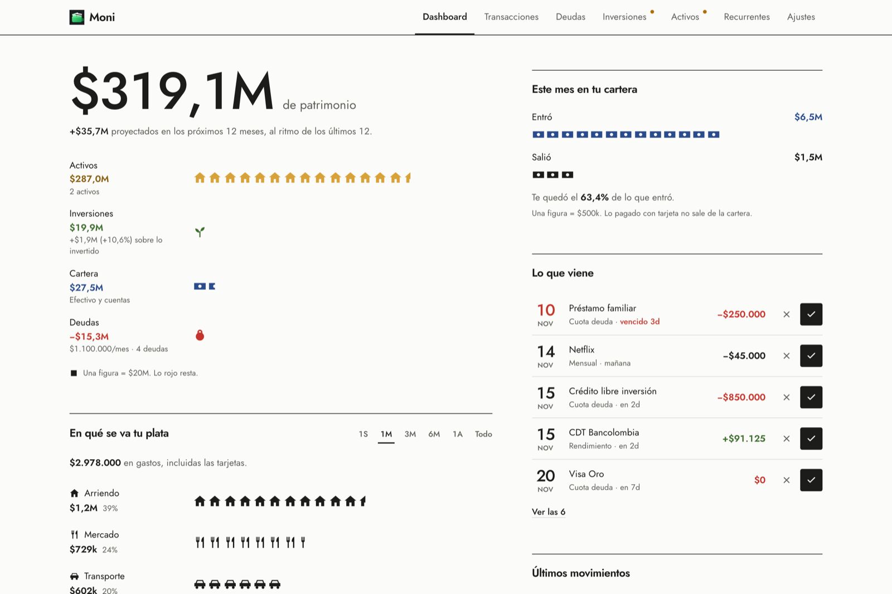
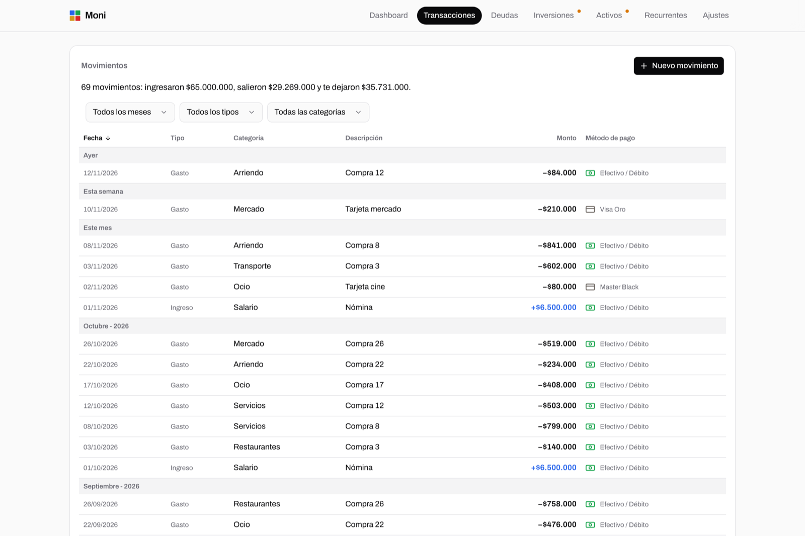
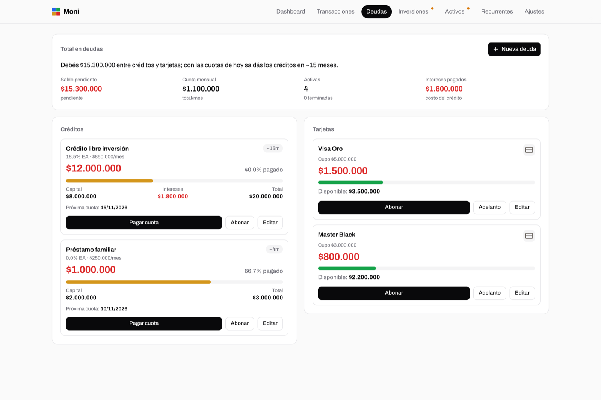
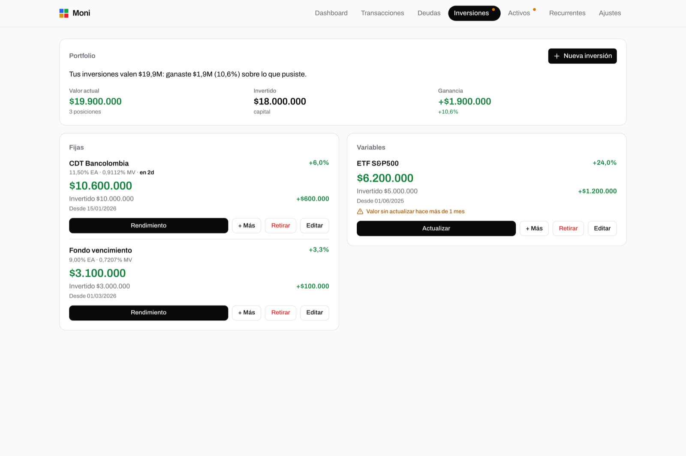
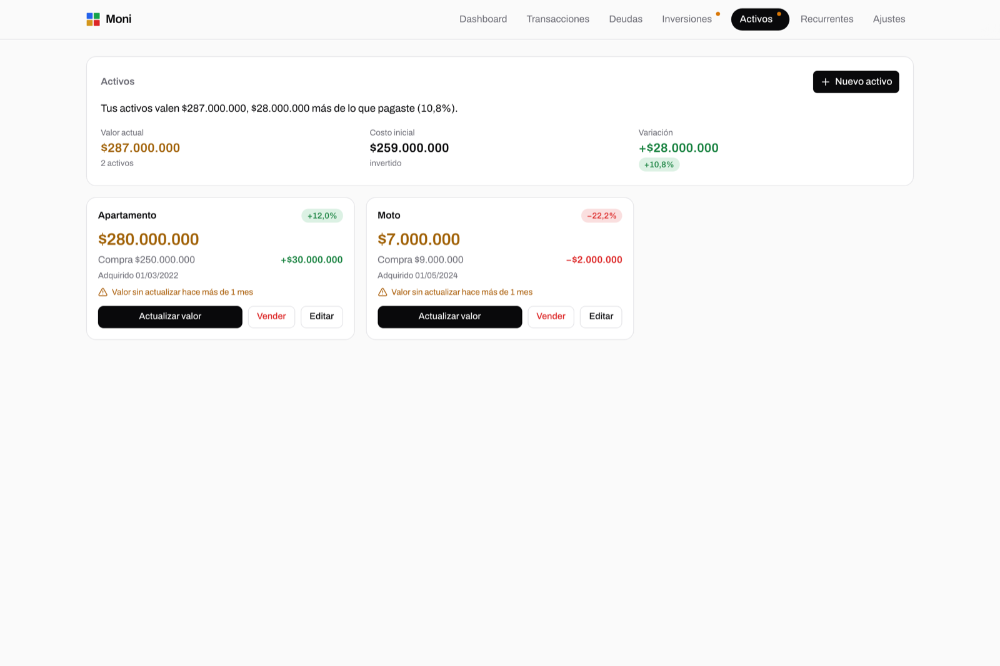
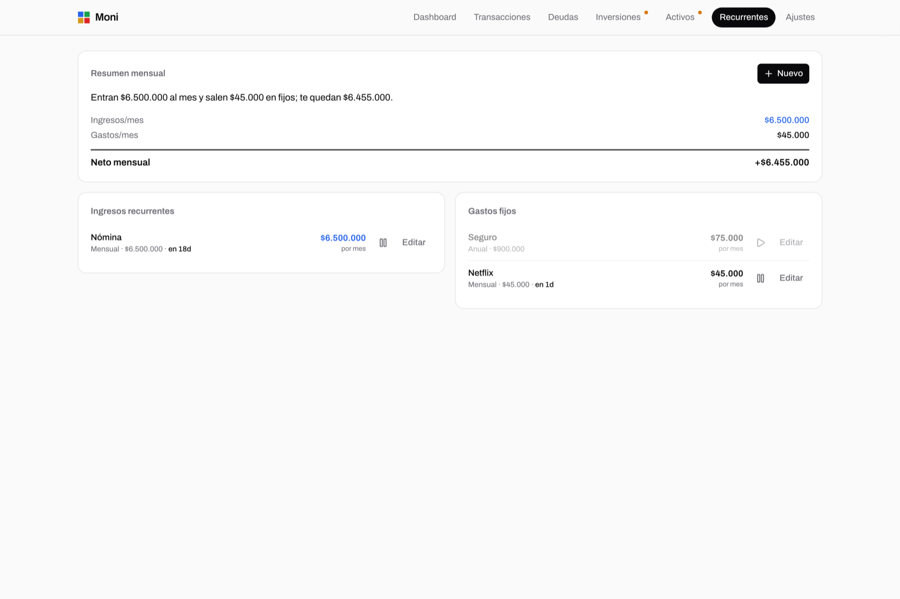
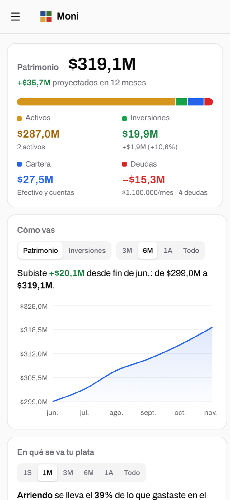
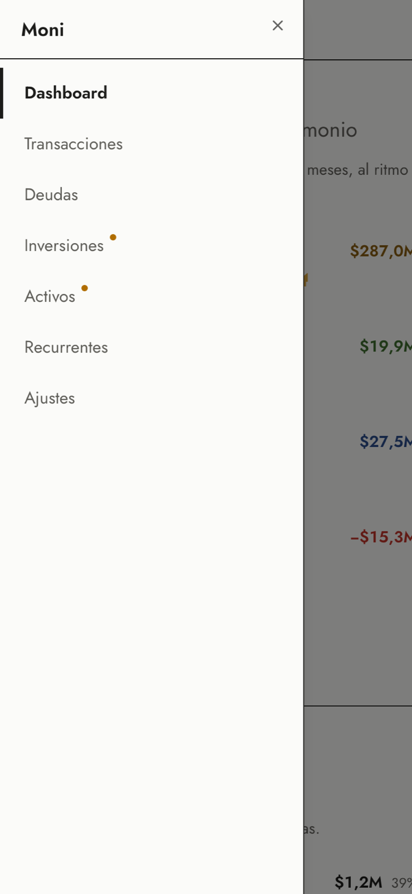

# Moni

Personal finance tracker for a single household: spending, credit cards, loans, investments, other assets, and recurring income/expenses — one dashboard instead of five spreadsheets. Spanish UI, Colombian peso (COP).

  



> ## LOCAL USE ONLY - NO AUTH
> This app has **no authentication or login system**. Anyone who can reach it can read and modify all data. It is meant to run on your local machine or a private/home network you trust.
>
> **Do not expose this to the public internet** (no open port-forward, no public reverse proxy) without putting your own auth layer in front of it (e.g. a reverse proxy with basic auth, a VPN/Tailscale, etc.).

## Contents

- [Features](#features)
- [How it fits together](#how-it-fits-together)
- [Running locally](#running-locally)
- [Running via Docker](#running-via-docker)
- [Deploying](#deploying)
- [Testing](#testing)
- [License](#license)

## Features

Six data tabs plus Ajustes (custom categories, hidden upcoming operations, currency symbol, backup import/export), all reading from and writing to the same dataset — a debt payment, an investment contribution, or an asset sale can each optionally drop a linked entry into the transaction ledger, so the numbers stay consistent everywhere.

**Dashboard** — net worth and per-category totals (cartera, inversiones, activos, deudas), a spending-by-category breakdown, net worth / investment evolution charts, recent transactions, and a "próximas operaciones" widget that projects upcoming debt installments, investment yields, and recurring charges so you can confirm or skip them before they happen.

**Transacciones** — the income/expense ledger, filterable by month, type, and category, grouped by date (ayer / este mes / …), tracking payment method (cash/debit vs. a specific card).



**Deudas** — two columns, créditos and tarjetas (`es_tarjeta`), each with pending balance, monthly installment, interest paid, per-debt cuota payments, card advances (adelanto), and payoff (liquidar); settled loans drop into a "terminados" section below. Registering the monthly cuota rolls the due date forward a month and clears it once the debt is settled; an extraordinary abono pays down the balance without moving the date.



**Inversiones** — fixed-rate (CDT-style, with EA/MV rate conversion and yield tracking) and variable investments (funds, crypto), each with capital invested, current value, gain/loss, and contribution/withdrawal actions. A yield is recorded as either capitalizing (raises the investment's value, no ledger entry) or paid out (income in the ledger, investment value unchanged) — never both, since counting it twice would inflate net worth.



**Activos** — physical/other assets (real estate, vehicles, …) with purchase cost vs. current value, value updates, and sale tracking.



**Recurrentes** — recurring incomes and fixed expenses (subscriptions, salary, …), with monthly income/expense/net totals and pause/resume.



Screenshots use dummy data inserted directly via the API for illustration, not real figures.

### Mobile

Below 640px the header nav collapses into a hamburger + slide-out drawer.

<table>
<tr>
<td></td>
<td></td>
</tr>
</table>

## How it fits together

FastAPI (`backend/main.py`) serves a small REST API over SQLite (`backend/db.py`) and, at the same time, serves the built frontend (`web/dist`) as static files: one process, one port in production.

The frontend (`web/`) is React + TypeScript built with Vite. Every tab is one folder under `web/src/features/` that owns its own component and modal forms; all of them read from a single `DataProvider` populated wholesale from `GET /api/all`. Any change (a new transaction, a debt payment, an edited category) goes through the API and then refetches everything. There's no optimistic UI and no partial state patching by design; the tradeoff is simplicity over snappiness, which is fine at personal-finance data volumes. The money math lives in pure, unit-tested functions under `web/src/lib/`.

Chart.js and the JetBrains Mono webfont are bundled from npm and `web/public/assets/fonts/`, so the app works on a LAN with no internet access. Only `web/dist` is reachable over HTTP; the backend code, the SQLite file and the frontend sources are not.

See `CLAUDE.md` for the full architecture rundown (schema/migrations, composite money-moving actions, per-tab conventions).

## Running locally

Needs Python 3.12 and Node 22. No installed venv/conda env in the repo, set one up ad hoc:

```bash
python3 -m venv .venv && source .venv/bin/activate
pip install -r backend/requirements.txt
uvicorn backend.main:app --reload --port 8080
```

Then, in another terminal, the frontend dev server (proxies `/api` to the backend on 8080):

```bash
cd web
npm ci
npm run dev
```

Open `http://localhost:5173`. To check what production serves, run `npm run build` in `web/` and open `http://localhost:8080`: FastAPI serves `web/dist`. Without a build the API still works, but `/` answers 404.

## Running via Docker

```bash
docker compose up --build
```

Serves on port 8080 (mapped to container port 80). The image is built in two stages: Node builds `web/`, and the final Python image carries only `backend/` and `web/dist`. SQLite file persists in the `moni-data` named volume at `/app/backend/data`.

## Deploying

`.github/workflows/build-push.yml` runs lint, typecheck, tests and the frontend build, then the backend tests, and, if all pass, builds and pushes the image to `ghcr.io/<owner>/moni` (tags `latest` and the commit SHA) on every push to `main`. In production, point `docker-compose.yml` at that image instead of `build: .`:

```yaml
services:
  moni-page:
    image: ghcr.io/juanhdzma/moni:latest
    ports:
      - "8080:80"
    restart: unless-stopped
    volumes:
      - moni-data:/app/backend/data

volumes:
  moni-data:
```

## Testing

The backend has a pytest suite covering the money-moving paths (card balance adjustments, the composite actions: payment, contribution, withdrawal, sale), input validation, the export/import round-trip and the static docroot. `test_static.py` reads `web/dist`, so build the frontend first.

```bash
cd web && npm ci && npm run build && cd ..
pip install -r backend/requirements-dev.txt
python -m pytest backend/tests -q
```

The frontend runs on Vitest + Testing Library. It covers the money and date math (cartera vs. net worth flows, recurring-payment dates, frequency normalization, money-input masking) and each tab's key flows, asserting the exact request sent to a mocked `fetch`. The test script pins the timezone to `America/Bogota`, so date bugs don't depend on where you run it.

```bash
cd web
npm run lint
npm run typecheck
npm test
```

CI runs all of the above before building the image. Each backend test gets a throwaway SQLite file, so runs never touch your real data. jsdom has no layout, so verify visual changes by exercising the app.

### Calling the API by hand

Mutating requests need an `X-Moni-Request` header. Without it the backend answers `403`; this is what stops a cross-origin `<form>` from hitting a destructive endpoint (see `require_csrf_header` in `backend/main.py`). Reads need nothing.

```bash
curl localhost:8080/api/all
curl -X POST localhost:8080/api/tx -H 'X-Moni-Request: 1' -H 'Content-Type: application/json' \
  -d '{"fecha":"2026-07-31","tipo":"gasto","categoria":"Mercado","monto":50000}'
```

## License

[AGPL-3.0](LICENSE)
